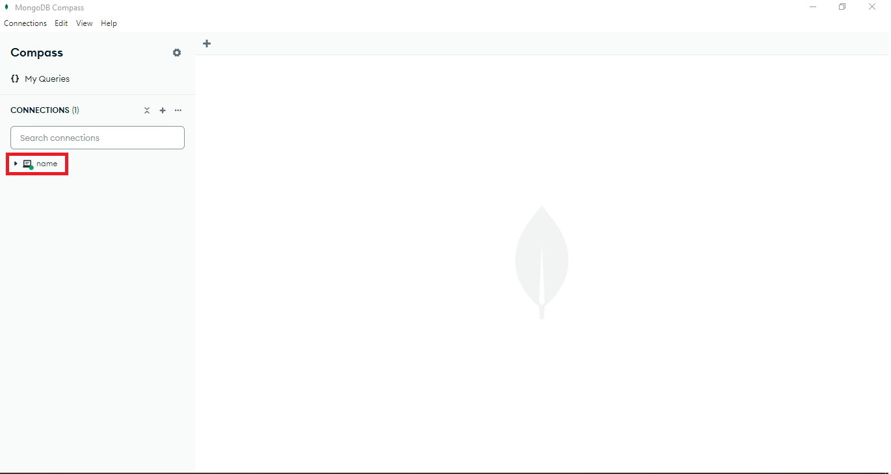
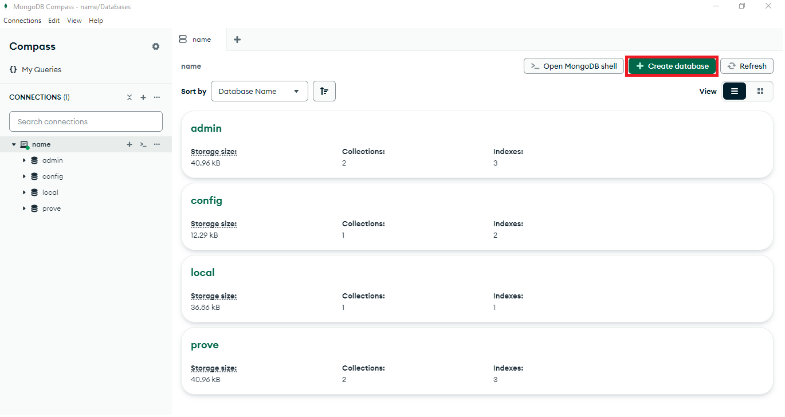
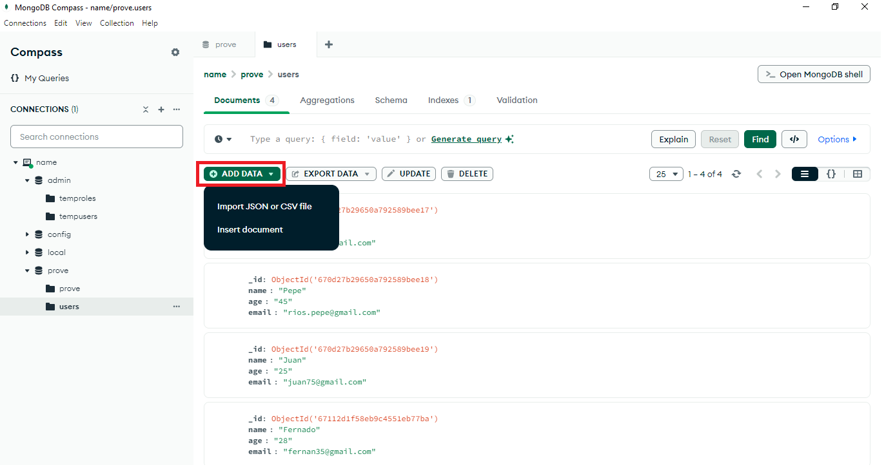
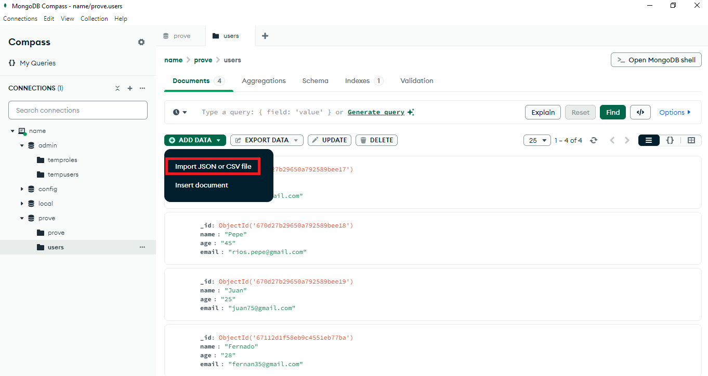
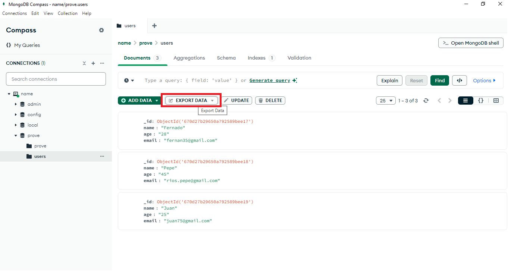
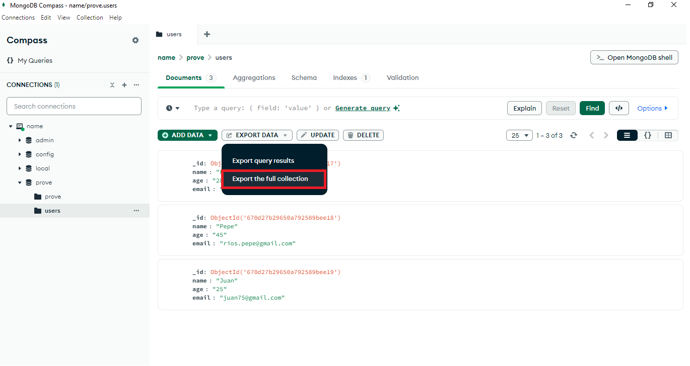
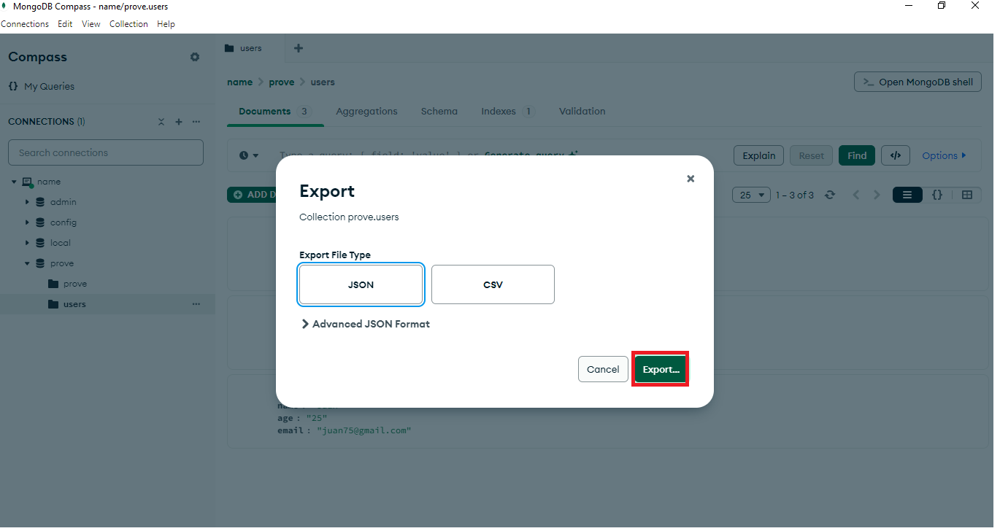

# Introduccion a los fundamentos basicos de mongodb

## Para llebar a cabo este proyecto es nesesario:

* Descargar MongoDB Compass 
* Descargar Docker 
* Ejecutar el comando: git clone https://github.com/kevin-pb/mongo-db-01.git
* Ejecutar el comando: docker pull mongo
* Abrir el terminal en en el directorio del archivo y ejecutar el comando: docker-compose 
  docker-compose-mongo.yml up -d

## En este proyecto se verá:

* Crear una base de datos y una colección
* Insertar documentos
* Actualizar un documento específico cambiando un campo específico
* Eliminar un campo específico por un campo específico
* Queries
* Creacion de un indicie
* Importacion y exportacion de datos

## Crear una base de datos y una colección

Una vez abramos el MongoDB Compass deberemos conectarnos a nuestra base de datos. Luego se crearan automáticamente unas bases de datos que no vamos a tocar, en la esquina superior derecha podrás ver un botón que dice crear base de datos, se nos abrirá un menu que nos dejara ponerle el nombre a la base de datos y a una coleccion en la cual trabajabaremos.

A continuación mostraré el proceso con imágenes:






## Insertar documentos

Para insertar documentos se ha de usar el comando insertOne o insertMany dependiendo de lo que se nesesite a continuacion se ve un ejemplo de ambos casos:

### insertMany:

```mongoDB
  db.users.insertMany([{"name":"Fernado", "age":"28", "email":"fernan35@gmail.com"}, 
  {"name":"Pepe", "age":"45", "email":"rios.pepe@gmail.com"}, {"name":"Juan", "age":"25", "email":"juan75@gmail.com"}])
```

### insertOne:

```mongoDB
db.users.insertOne({"name":"Fernado", "age":"28", "email":"fernan35@gmail.com"})
```

## Actualizar un documento específico cambiando un campo específico
A contuinuacion hay un ejemlo de como actualizar un usuario:

```mongoDB
  db.users.updateOne({"email":"rios_pepe@gmail.com"}, {$set:{"age":"47"}})
```

## Eliminar un campo específico por un campo específico
A contuinuacion hay un ejemlo de como eliminar un usuario: 

```mongoDB
  db.users.deleteOne({"email":"rios_pepe@gmail.com"})
```
## Queries:

```mongoDB
db.users.find()
```
This query allows you to obtain all the documents in a collection.

```mongoDB
db.getCollection("users").find({"age" : {$gt: 25}})
```
Perform a query to find all users over the age of 25.

```mongoDB
db.getCollection("user").aggregate([{$group: {_id: null, averageAge: { $avg: "$age" }}}])
```
Uses the Aggregation Framework to calculate the average age of all users.

```mongoDB
db.users.find().sort({ age: -1 })
```
Implement a query to return users sorted by age in descending order. In this code, the -1 symbolizes that it is in descending order, for ascending order you need to put a 1.

```mongoDB
db.users.find({}, { name: 1, age: 1, _id: 0})
```
Create a query that returns only the “name” and “age” fields of the users. In this code you must include only what you want to obtain, in this case the name field and the age field, which means that if you have another field such as email you should not include it, on the other hand, you must include the id because if you do not include it, it will still be included, but if you include the id with a value of one like the rest, it will continue to appear, which is why it is necessary to put zero. In this code, the {} symbolizes that no filter is being made and it will give all the information.

## Creating an index

```mongoDB
db.getCollection("prove").createIndex( {email:1} )
```
This command allows you to create an index to optimize queries.

## Import and export of data

### Import: 

To import data, it is necessary to follow these steps:





And finally select a file and press the button to accept.

### Export: 

To export data, it is necessary to follow these steps:







And finally select the place to colocate the file and press the button to accept.
