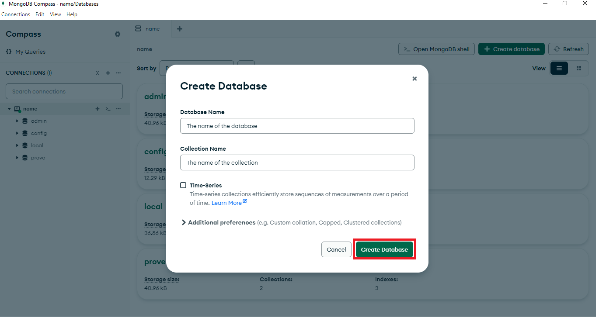

# Introduction to the basics of mongodb

## To carry out this project it is necessary:

* Download MongoDB Compass
* Download Docker
* Run the command: git clone https://github.com/kevin-pb/mongo-db-01.git
* Run the command: docker pull mongo
* Open the terminal in the directory of the file and run the command: docker-compose
docker-compose-mongo.yml up -d

## In this project you will see:

* Create a database and a collection
* Insert documents
* Update a specific document by changing a specific field
* Delete a specific field by a specific field
* Queries
* Create an index
* Import and export data

## Create a database and a collection

Once we open MongoDB Compass we must connect to our database. Then some databases will be created automatically, which we will not touch. In the upper right corner you will see a button that says create database. A menu will open that will allow us to name the database and a collection in which we will work.

I will show the process with images below:




## Inserting documents

To insert documents you must use the insertOne or insertMany command depending on what you need. Below is an example of both cases:

### insertMany:

```mongoDB
  db.users.insertMany([{"name":"Fernado", "age":"28", "email":"fernan35@gmail.com"}, 
  {"name":"Pepe", "age":"45", "email":"rios.pepe@gmail.com"}, {"name":"Juan", "age":"25", "email":"juan75@gmail.com"}])
```

### insertOne:

```mongoDB
db.users.insertOne({"name":"Fernado", "age":"28", "email":"fernan35@gmail.com"})
```

## Update a specific document by changing a specific field
Here is an example of how to update a user:

```mongoDB
  db.users.updateOne({"email":"rios_pepe@gmail.com"}, {$set:{"age":"47"}})
```

## Delete a specific field by a specific field
Here is an example of how to delete a user:
```mongoDB
  db.users.deleteOne({"email":"rios_pepe@gmail.com"})
```
## Queries:

```mongoDB
db.users.find()
```
This query allows you to obtain all the documents in a collection.

```mongoDB
db.getCollection("users").find({"age" : {$gt: 25}})
```
Perform a query to find all users over the age of 25.

```mongoDB
db.getCollection("user").aggregate([{$group: {_id: null, averageAge: { $avg: "$age" }}}])
```
Uses the Aggregation Framework to calculate the average age of all users.

```mongoDB
db.users.find().sort({ age: -1 })
```
Implement a query to return users sorted by age in descending order. In this code, the -1 symbolizes that it is in descending order, for ascending order you need to put a 1.

```mongoDB
db.users.find({}, { name: 1, age: 1, _id: 0})
```
Create a query that returns only the “name” and “age” fields of the users. In this code you must include only what you want to obtain, in this case the name field and the age field, which means that if you have another field such as email you should not include it, on the other hand, you must include the id because if you do not include it, it will still be included, but if you include the id with a value of one like the rest, it will continue to appear, which is why it is necessary to put zero. In this code, the {} symbolizes that no filter is being made and it will give all the information.

## Creating an index

```mongoDB
db.getCollection("prove").createIndex( {email:1} )
```
This command allows you to create an index to optimize queries.

## Agregation Frameworck

Here, the Aggregation Framework is used to calculate the average age of all users. The Aggregation Framework is, in a nutshell, a way of performing complex queries in NoSQL.

```mongoDB
db.getCollection("users").aggregate([{$group: {_id: null, averageAge: { $avg: "$age" }}}])
```

## Import and export of data

### Import: 

To import data, it is necessary to follow these steps:


And finally select a file and press the button to accept.

### Export: 

To export data, it is necessary to follow these steps:


And finally select the place to colocate the file and press the button to accept.
